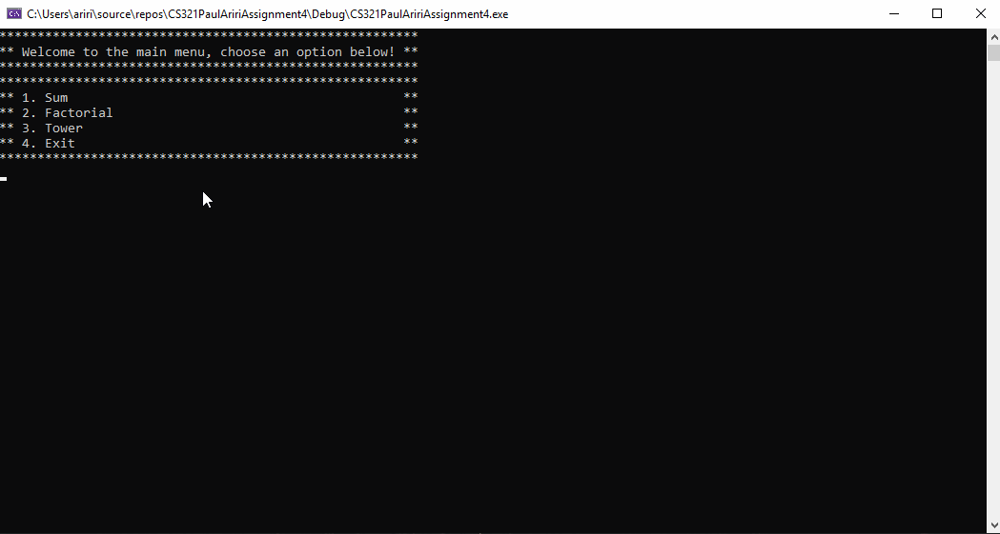

# TowerOfHanoi-Factorial-and-SumOver
User Based C++ Program Recursion Implementing

📝 `NOTE:` Below is the Walkthrough

### App Walk-through

- [x] Apply recursion to whole project
- [x] Implement sumover function
- [x] Implement factorial function
- [x] Implement Tower of Hanoi function
- [x] Push code to GitHub
